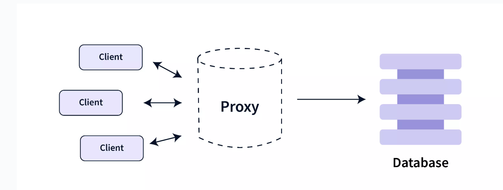
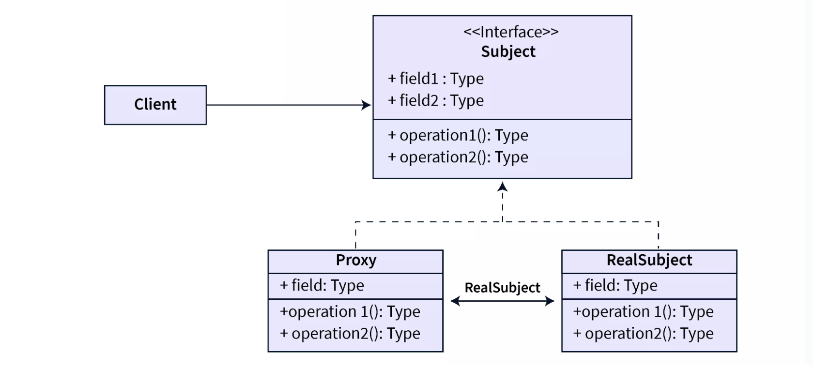

# Proxy Pattern

Proxy pattern is  Structural design pattern which is used whenever we need a placeholder or representational object that
can work in place of the real object. The proxy acts as an intermediatory layer between the client and the real object
and hence can control the access to the real object, add additional functionality, and even restrict client access. It
is also known as Surrogate Pattern.

## How Does Proxy Design Pattern Work?
A proxy in the real world is someone who can act as a substitute for another person, whether in corporate work, in-person attendance, etc. The main characteristic of a proxy is its similarity with the original object. This feature makes the proxy indistinguishable and allows it to act as a substitute for the real object.

The Proxy Design Pattern allows us to create a proxy class whose objects can be used in place of original objects in an application. The proxy acts as an intermediatory layer between the client and the real object and hence can control the access to the real object. The proxy class also allows us to add extra functionality by performing something either before or after the client request gets through to the original object.

By using the proxy design pattern we can provide representational objects (proxies) to the client instead of real objects. Due to the similarity between the proxy and the real object, the client can be completely unaware of the proxy present between the client and the real object. This similarity between the proxy and the real object is achieved by implementing the same interface in the proxy as that used by the real object.

Based on the functionality the proxy provides, there can be three different kinds of proxies that we can use in an application:

* **Remote Proxy**: These are used to provide a local representation of a remote object (the object that belongs to a different address space). Here we create a local copy of an object that lies on the server for faster loading.
* **Virtual Proxy**: These are used to delay the construction/loading of the actual object until absolutely necessary. A virtual proxy is a placeholder for heavy or expensive-to-create objects. This is the proxy that was elaborated in the above example of the Image application.
* **Protection Proxy**: Protection proxies are bodyguard proxies that control access to the original object's methods. It acts as an authentication system that allows only authentic client requests to pass through to the actual object.

Here, we can notice that the Proxy Design Pattern uses the following terms:

**Subject (Interface)**

* It defines the interface which is used by the client.
* It is the common interface for RealSubject and Proxy so that a Proxy can be used anywhere a RealSubject is expected.
* It defines the operations that are to be expected by the actual implementations.

**RealSubject (Normal Class)**

* It implements the Subject and provides the real implementation of the operations defined in the Subject Interface. It provides the actual functionality in the application by overriding the operations defined by the Subject Interface.
* It provides some useful business logic.

**Proxy (Normal Class)**

* It implements the Subject Interface to disguise itself as a Real Subject's object.
* It also maintains a reference to the RealSubject to provide actual functionality.
* It controls access to the RealSubject and may be responsible for its creation and deletion.

### Pros and Cons of Proxy Design Pattern
Let's look at some advantages of the Proxy Design Pattern:

* **Security**: Proxy provides an additional layer of protection to the original object from the outside world by adding an intermediatory layer between the client and the actual implementations.
* **Better Performance**: By avoiding the creation or duplication of memory-intensive objects and caching frequently accessed objects, proxies can improve the performance of the application.
* **Reliability**: Since the proxy is similar to the actual object and contains the essential information related to the object, the proxy can work in place of actual objects even if the actual service is not ready or is not available.

Now, let's understand some of the **disadvantages** of the Proxy Design Pattern:

* **Complexity**: We have to write repeated code as the proxy is similar to the actual object. Hence, it increases the code complexity.
* **Extra Effort**: To update the application, the developer must concurrently update the proxy object alongside the real object.
* **Ambiguity**: Proxies are meant to act as a substitute for real and heavy objects. If somehow, some clients are able to directly access the real objects instead of proxies, then the application may exhibit disparate behavior.

Q: **When should we use the Proxy Design Pattern?**

A: Proxy Design Pattern is used whenever we want: - Lazy initialization: Process of delaying the creation of resource-intensive object until it's absolutely necessary. (Virtual Proxy) - Local Representation: Whenever we need a local representation of a remote object i.e., the object present in a different address space. (Remote Proxy) - Logging and Caching: Whenever we need to add a level of security by logging the requests and providing controlled access to the object. (Protection Proxy)